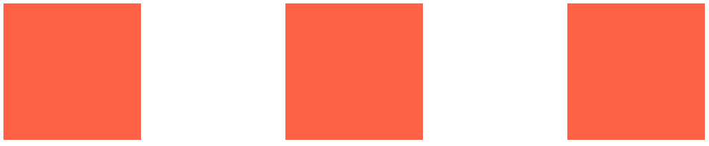

## 챌린지 설명

CSS Layout 챌린지를 도전하면서 배운것들을 기록합니다.

### 1. Flex Box가 나오게 된 배경

웹페이지를 생성할때 레이아웃을 만든다는게 쉬운일이 아닙니다.  
아래와 같이 flexbox를 사용하지 않고 3개의 박스를 한 화면에 나란히 배치시켜 보도록 하겠습니다.
  
  
  

```html
//HTML 파일에서
  <div class="box"></div>
  <div class="box"></div>
  <div class="box"></div>
```
```css
//CSS 파일에서
  .box{
    width:200px;
    height:200px;
    background-color:tomato;
  }

  .box:first-child {
  margin-right: 20%;
  }

  .box:last-child {
    margin-left: 20%;
  }
```
px을 사용하지 않고 나름 반응형에 적용한다고 %를 사용하여 작업해보았습니다.  
하지만 브라우저의 크기가 너무나도 다양하기 때문에 flexbox를 사용하지 않고 레이아웃을
만드는 일은 엄청난 시간과 노력을 요구합니다.
  

이렇게 우리가 하는 계산을 컴퓨터가 대신 해주면 어떨가?  
하는 생각에 flexbox가 나타나게 되었습니다.  