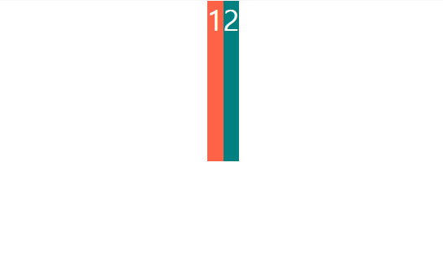
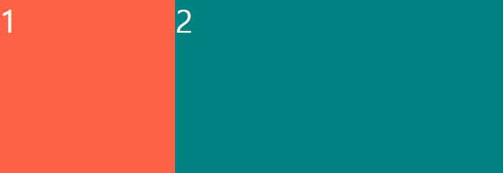

## 챌린지 설명

CSS Layout 챌린지를 도전하면서 배운것들을 기록합니다.

### 1. 반응형 레이아웃 만들기  

화면의 크기가 다양하기 때문에 width를 직접 px단위로 준다면 레이아웃이 화면마다 다르게 나타나게 됩니다. 따라서 flex를 이용해서 레이아웃을 많이 구성합니다.  
flex의 특성을 가지고 px이 아닌 비율로 크기를 조절할 수 있습니다.

```html  
  // html 파일에서
  <body>
    <div class="father">
      <div class="box">1</div>
      <div class="box">2</div>
    </div>
  </body>  
```  
```css  
  // css 파일에서
  html, body {
    margin: 0;
    padding: 0;
  }

  .father {
    display: flex;
    height: 100vh;
    justify-content: center;
    flex-flow: row wrap;
  }

  .box {
    height: 200px; <--아이템에 넓이는 주지 않았습니다.  
    color: white;
    font-size: 36px;
    display: flex;
  }

  .box:first-child {
    background-color: tomato;
  }

  .box:last-child {
    background-color: teal;
  }
```  
  
위의 코드를 사용하면 브라우저에 아래와 같이 출력됩니다.  

  

* * *  
각각의 아이템에 비율을 조절하기 위해서는 flex-grow 속성을 이용하면 됩니다.  

```css
.box:first-child {
  background-color: tomato;
  flex-grow: 1;  <---추가한 부분
}

.box:last-child {
  background-color: teal;
  flex-grow: 2;  <---추가한 부분
}
```  
상대적인 값이므로 아래처럼 화면이 채워집니다.  

 