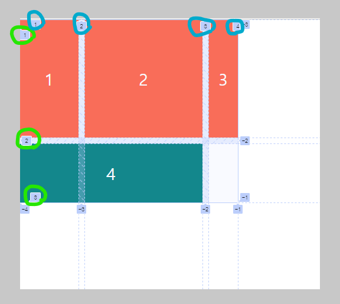
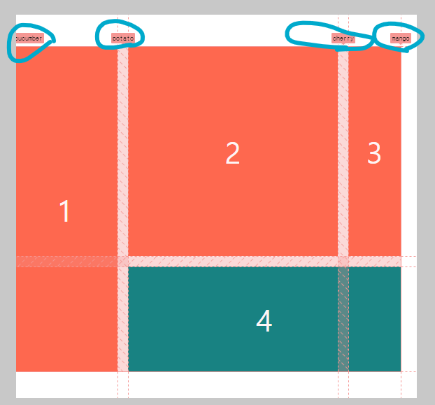
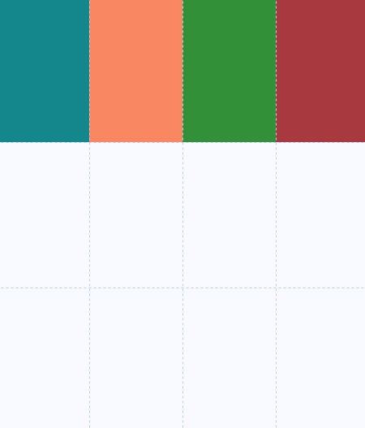

## 챌린지 설명

CSS Layout 챌린지를 도전하면서 배운것들을 기록합니다.

### 1. Grid란 

Flexbox가 1차원 레이아웃 시스템인 반면 Grid는 2차원 레이아웃 시스템입니다.  
Flexbox보다 강력하게 열과 행을 모두 제어하고 커스터마이징 할 수 있습니다.  
Grid역시 Flexbox와 마찬가지고 부모에게 명령을 합니다. 또한 Flexbox와 똑같은 속성을 사용하기도 합니다. Grid의 단위는 셀입니다.

### 2. Grid 속성  

> 1.grid-template-columns / grid-template-rows    
>   행 / 열의  크기를 나타내주는 속성입니다. 사용단위로는 px이나 fr로 사용합니다.  
> ```css
>   .father {  // 부모컨테이너
>      display: grid;  
>      grid-template-columns: 100px 200px; // 2x2의 레이아웃 생성 - 행
>      grid-template-rows: 2fr 1fr; // 2x2의 레이아웃 생성 - 열  
>       ※fr의 경우는 fraction의 약자로 비율을 의미함.
>     gap: 10px;
>    }
> ```  
> 2. grid-column-start / gird-column-end  
>    각 아이템을 원하는 위치의 시작점과 끝점을 지정하여 위치할 수 있습니다.  
>    
>     ※파란동그라미는 column의 위치 번호  
>     ※연두동그라미는 row의 위치 번호  
>    
>  ```css
>  .child:last-child {
>    background-color: teal;
>    grid-column-start: 1;  // 시작 위치 번호  
>    grid-column-end: 3;  // 끝 위치 번호  
>     -> 내가 마지막 위치 번호를 모르는 경우 -1은 마지막 위치번호 입니다.  
>    grid-column: 1 / 3 // 위의 두 명령을 하나로 줄여서 사용할 수 있습니다.  
>   } 
> 
> 예시) 
> .father {
>    display: grid;  
>    grid-template-columns:[cucumber] 100px [potato] 200px [cherry] 50px [mango];  
>       [ ]안의 이름은 그리드 형태를 브라우저에 나타낼때 이름으로 사용할 수 있습니다.
>  }  
>```  
>
> 위에서 처럼 바꿔주면 아래에서 이름을 확인할 수 있습니다.   
>  
>  
>  
> 3. grid-template-area / grid-area 
>   텍스트로 grid의 템플릿을 디자인하게 해줍니다. 
>
>  
>
> 위와같이 레이아웃을 만들기 위해서 두가지 속성을 이용하면 편리하게 만들 수 있습니다.  
>
> ```css
> .father {
>    display: grid;
>    height: 100vh;
>    grid-template-columns: 1fr 1fr 1fr 1fr;
>    grid-template-rows: 1fr 1fr 1fr 1fr;
>    grid-template-areas: 
>      "header header header header" // 텍스트로 같은 영역을 같은 이름으로 정의해줌.
>      "content content content menu"
>      "content content content menu"
>      "footer footer footer footer";
>  }
>
>  header {
>    background-color: teal;
>    grid-area: header; // 각 영역에 정의된 이름을 선언해줌.
>  }
>
>  section {
>    background-color: coral;
>    grid-area: content; // 각 영역에 정의된 이름을 선언해줌.
>  }
>
>  aside {
>    background-color: forestgreen;
>    grid-area: menu; // 각 영역에 정의된 이름을 선언해줌.
>  }
>
>  footer {
>    background-color: brown;
>    grid-area: footer; // 각 영역에 정의된 이름을 선언해줌.
>  }
> ```   
>  ※위의 속성을 하나로 줄여서 사용하는 방법이 있습니다.  
>    grid-template-columns / grid-template-rows / grid-template-areas를 grid-template로 합쳐서 사용할 수 있습니다. 아래처럼 써도 동일한 결과를 얻을 수 있습니다.
> ```css
> .father {
>    display: grid;
>    height: 100vh;
>     grid-template: 
>      "header header header header" 1fr  // 행의 크기를 지정해줌
>      "content content content menu" 1fr // 행의 크기를 지정해줌
>      "content content content menu" 1fr // 행의 크기를 지정해줌
>      "footer footer footer footer" 1fr / 1fr 1fr 1fr 1fr; // 행의 크기 / 열의 크기를 지정해줌
>  }
>```  
> 4. span  
>    grid-column이나 grid-row에서 span 키워드를 사용하면 아이템을 좀 더 쉽게 배치할 수 있습니다.  
>    span 숫자 <--이렇게 조합하면 숫자만큼 라인을 확장하는 개념입니다.  
>    시작위치 / span 숫자  <--시작점부터 숫자만큼 확장하는 개념입니다.  

### 3. Grid로 레이아웃 만들기  

Grid를 이용해 위처럼 레이아웃을 만들어 보겠습니다.   

  
  
html 구성은 아래와 같고 영역은 배경색으로 구분하였습니다.

```html
  <body>
    <div class="father">
      <header></header>
      <section></section>
      <aside></aside>
      <footer></footer>
    </div>
  </body>
```
영역별로 fr을 이용해 레이아웃을 만들 수 있습니다.

```css
html, body { // body의 경우 기본적으로 너비는 뷰포트를 가짐.
  margin: 0;
  padding: 0;
}

.father {
  display: grid;
  height: 100vh;  // body의 height는 기본값이 없어서 여기서 높이를 줘야함.
  grid-template-columns: 1fr 1fr 1fr 1fr; // 4개의 행을 가짐.
  grid-template-rows: 1fr 1fr 1fr;  //3개의 열을 가짐.
}

header {
  background-color: teal;
}

section {
  background-color: coral;
}

aside {
  background-color: forestgreen;
}

footer {
  background-color: brown;
}
```


