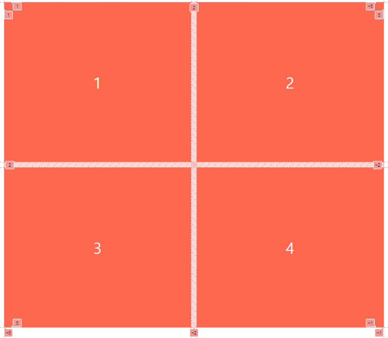
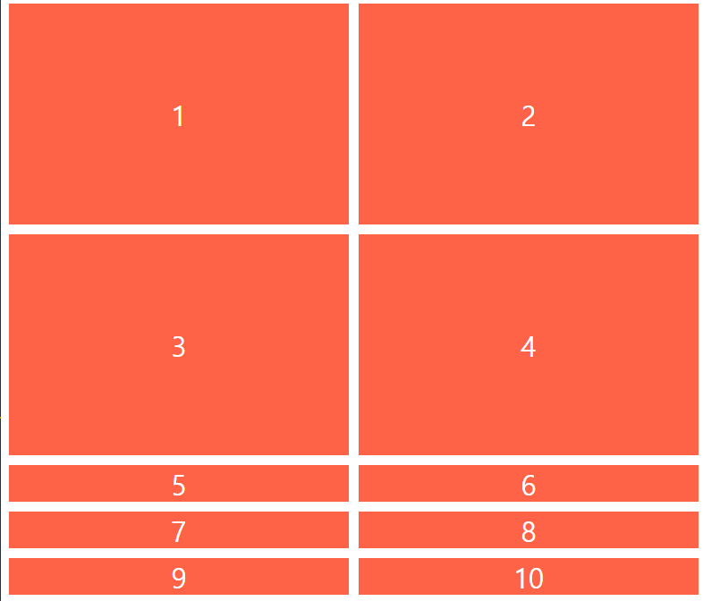
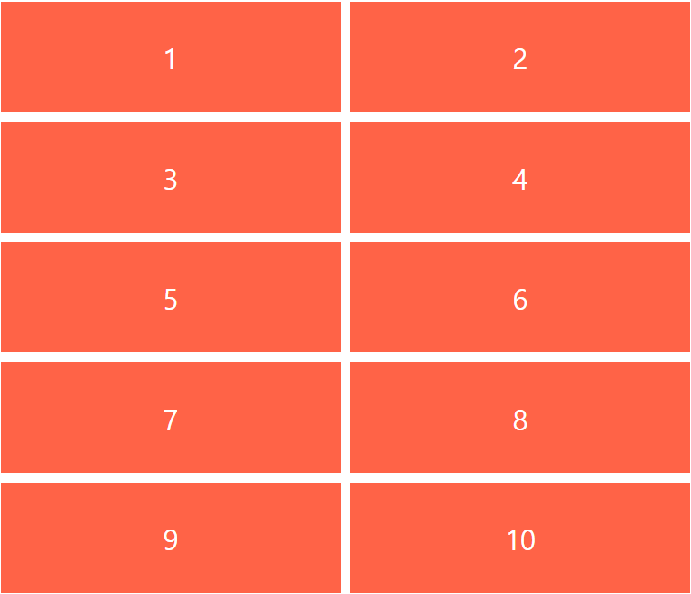
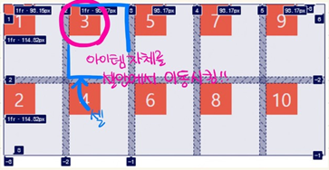
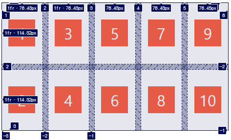
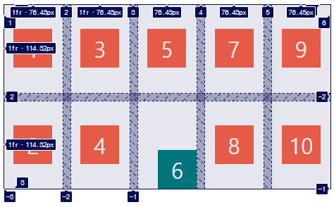
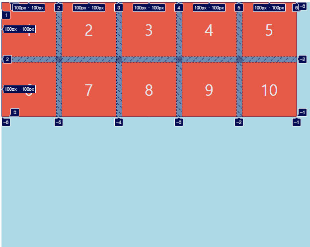
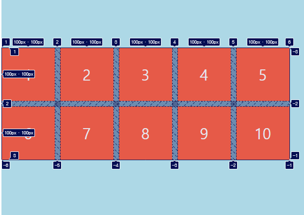

## 챌린지 설명

CSS Layout 챌린지를 도전하면서 배운것들을 기록합니다.

### 1. Grid의 응용버전  

Grid를 사용하다 보면 동적으로 컨텐츠가 생기는 경우를 접하게 됩니다.  
이런경우 준비되지 않은 콘텐츠에 대해 grid-auto-columns / grid-auto-row / grid-auto-flow의 속성을 통해 grid에 어떤 일이 발생할 지 결정할 수 있습니다.  
예를 들어 2x2의 column과 row를 만든다고 생각해 봅시다.  

```html
 <div class="father">
  <div class="child">1</div>
  <div class="child">2</div>
  <div class="child">3</div>
  <div class="child">4</div>
 </div>
```

```css
  .father {
    min-height: 50vh;
    display:flex;
    grid-template-columns: repeat(2, 1fr);
    grid-template-rows: repeat(2, 1fr);
    gap: 10px;
  }

  .child {
    background-color: tomato;
    color: white;
    font-size: 28px;
    display: flex;
    justify-content: center;
    align-items: center;
  }
```  
아래와 같이 2x2형태로 레이아웃이 그려졌습니다.  



만약 유저가 동적으로 콘텐츠를 작업하는 경우, item의 갯수가 유동적이므로 실제 HTML을 제어할 수가 없습니다. 예를 들어 6개의 콘텐츠가 늘어나 총 10개의 콘텐츠가 생긴 경우를 생각해 봅시다.  
4개의 콘텐츠가 동일하게 차지하던 레이아웃이 이상하게 변한것을 확인할 수 있습니다.  



이때 grid-auto-columns / grid-auto-row / grid-auto-flow의 속성을 통해 아직 준비되지 않은 콘텐츠에 대해 미리 정해줄 수 있습니다.  

```css
  grid-auto-rows: 1fr; // 이 속성을 정해주면 동일한 크기의 row을 형성할 수 있습니다.
```
위의 속성을 적용시켜 주면 아래처럼 레이아웃이 변경됩니다.  

  

```css
  grid-auto-columns: 1fr; // 이 속성을 정해주면 동일한 크기의 column을 형성할 수 있습니다.
```  

새로 추가될 콘텐츠가 행(row)으로 추가될지 열(column)로 추가될지 정하는 속성이 grid-auto-flow입니다.  

```css
  grid-auto-flow: row; // 새로 추가되는 콘텐츠가 행으로 추가됩니다.
``` 

이렇게 동적인 콘텐츠에 대해 미리 지정해줘서 레이아웃을 정할 수 있게 해줍니다.  
grid로 레이아웃을 한 리스트가 동적으로 형성되는 곳에서 grid-auto- 속성을 이용하면 스타일의 깨짐없이 개선된 화면을 구성할 수 있습니다.  

### 2. Grid의 각 셀 내부 콘텐츠 정렬되는 방식을 변경할 수 있는 속성들  

  

그림에서처럼 셀 안의 아이템의 크기가 50px, 50px로 지정된 경우 위와 같은 레이아웃을 가집니다.  
이때 저 아이템을 셀 안에서 이동시키기 위해서는 justify-items / align-items 이 두가지 속성을 사용하여 이동시킬 수 있습니다.  
아이템의 width, height가 지정되지 않으면,  justify-items / align-items 두 값의 기본값은 stretch값을 가져서 셀안을 수평 또는 수직 방향으로 채워줍니다. 
반면 width를 가진 경우 justify-items 는 아이템을 수평방향으로, height를 가진 경우 align-items는 아이템을 수직방향으로 이동시킬 수 있습니다.    
justify-items / align-items의 옵션으로 start / end / center / stretch 이 자주 사용됩니다.  
위의 형태에서 아래와 같은 속성을 사용하면 아이템을 셀 한가운데로 이동시킬 수 있습니다.  
또한, 이 두가지 속성을 place-items를 사용하면 한번에 모두 나타낼 수 있습니다. 

```css
  justify-items: center;  // 수평방향으로 가운데
  align-items: center;    // 수직방향으로 가운데  

  place-items: center center;  // 위 두속성을 한번에 나타내줌. (수직, 수평)
```    
   

아이템을 전체 이동시킬 때 justify-items / align-items를 사용했다면, 아이템 각각을 이동시키기 위해서는 align-self / justify-self 속성을 해당 아이템에 주면 됩니다. 
6번 아이템만 셀 끝쪽으로 이동시키기 위해서는 해당 아이템에게만 아래와 같은 속성을 적용시켜 줍니다.  
옵션의 경우에는 justify-items / align-items와 동일하게 사용할 수 있습니다.  
place-items와 마찬가지고 이 두가지 속성도 place-self를 이용해서 한번에 나타낼 수 있습니다.  

```css
  justify-self: end;  // 수평방향으로 끝
  align-self: end;    // 수직방향으로 끝  

  place-self: end end;  // 위 두속성을 한번에 나타내줌. (수직, 수평)
```    
  

### 3. Grid의 셀 자체를 정렬하는 방법  

  

```css
  .father {
    height: 100vh;
    gap: 10px;
    display: grid;
    grid-template-columns: repeat(5, 100px);
    grid-template-rows: repeat(2, 100px);
    background-color: lightblue;  // grid 컨테이너를 가르킴.
    align-content: center;  // grid 컨테이너 자체가 수직으로 정렬됨.
    justify-content : center; // grid 컨테이너 자체가 수평으로 정렬됨.

    place-content: center center; // 두가지 속성을 한번에 나타냄. (수직, 수평)
  }
```
위와같은 Grid 위치를 시작이 아닌 Grid 컨테이너 가운데로 정렬하고자 한다면, align-content 속성을 사용하면 아래와 같이 Grid 컨테이너가 가운데로 정렬됩니다.  
기본값은 start이고 end, center, space-between, space-around, space-evenly 와 같은 옵션을 사용할 수 있습니다.  
또한, justify-content는 수평방향으로 정렬한다는 점만 다르고, 나머지는 동일한 방법으로 사용가능 합니다.



justify- / align- 속성은 Grid 컨테이너에 여분 공간이 있는 경우에만 작동합니다.  
남는 공간이 없으면 아이템을 넣을 곳이 없기 때문에 아이템이 움직이지 못하게 됩니다.  
따라서 grid-template- 속성을 사용할 때 fr단위가 아닌 px단위로 사용해야 위 두가지 속성을 적용할 수 있습니다.  


