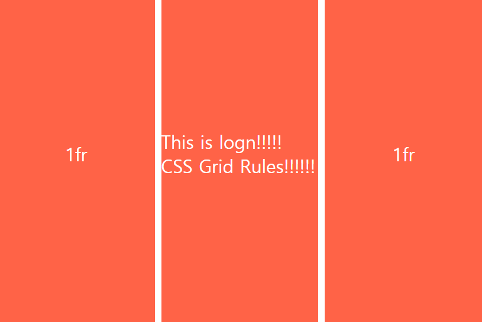
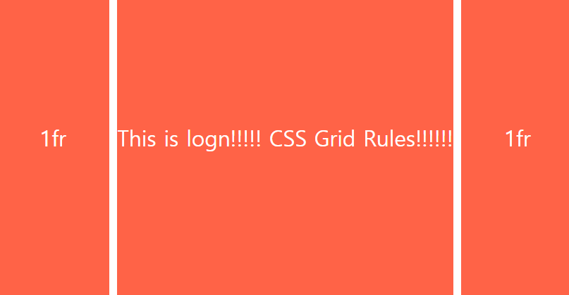
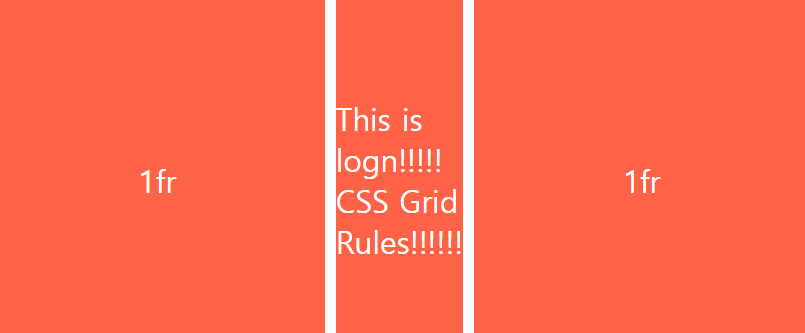
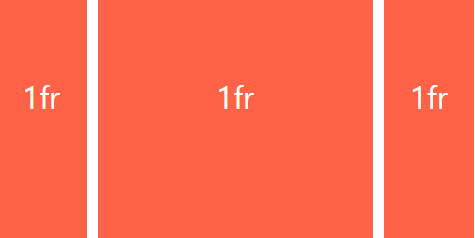
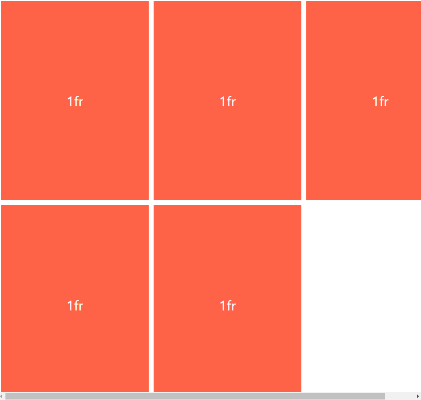

## 챌린지 설명

CSS Layout 챌린지를 도전하면서 배운것들을 기록합니다.

### 1. Grid의 응용 속성들 - max-content / min-content 

```css
  .father {
    height: 100vh;
    gap: 10px;
    display: grid;
    grid-template-columns: 1fr 1fr 1fr;
  }
```  

  


위와 같이 내용물(텍스트)이 있어도 열의 크기를 1fr로 지정했기 때문에 열의 크기는 변화하지 않고 텍스트가 두줄로 보여집니다. 이때 텍스트를 한줄로 보이도록 열을 나타내고자 한다면 해당 열의 크기에 max-content속성을 주면 아래와 같이 레이아웃이 변경됩니다. 
또한 내용물의 크기를 px단위로도 지정할 수 있습니다.   



min-content의 경우 텍스트의 가장 긴단어의 길이를 기준으로 열의 최소 길이를 레이아웃으로 잡습니다.  
아래와 같이 모두 텍스트가 쪼개져 나타나는 것을 확인할 수 있습니다.  



### 2. 반응형 그리드를 구축시 많이 사용하는 속성 - minmax()함수

페이지 크기를 줄일 때, 가운데 열이 400px미만으로 줄어들지 않도록 하기 위해서는 minmax()함수를 사용할 수 있습니다.  

```css
  .father {
    height: 100vh;
    gap: 10px;
    display: grid;
    grid-template-columns: 1fr minmax(250px, 1fr) 1fr;
  }  // minmax(최소크기, 최대크기) -> 최대로 1fr까지 최소로 250까지 보여줌.
```  
minmax()함수를 이용하면 원래는 세개의 열이 동일하게 너비를 나눠서 가지고 있다가 크기를 줄였을때 아래와 같은 레이아웃으로 변경됩니다.  



※ minmax()함수는 repeat()안에도 사용할 수 있습니다.   
 예시) repeat(3, minmax(300px, 1fr))  
       -> 3번 반복하면서 최소 300px 최대 1fr까지 늘어나도록 레이아웃이 설정됨.  

### 3. 반응형 그리드를 구축시 많이 사용하는 속성 - autofit / autofill  

화면의 사이즈에 따라 아이템이 3개, 2개, 1개씩 보여져야 잘 짜여진 레이아웃이라고 할 수 있습니다.  
하지만 아래처럼 레이아웃을 작성한 경우, 브라우저가 작아졌을 때 스크롤이 생겨 불편함을 줄 수 있습니다.  

```css
  grid-template-columns: repeat(3, minmax(300px, 1fr));  
```  

  

```css
  grid-template-columns: repeat(auto-fill, minmax(300px, 1fr));  
    // auto-fill 대신 auto-fit을 사용해도 동일하게 레이아웃을 변경시켜 줍니다.  
    // 두가지의 차이점은 남은 공간으로 무엇을 하는가 입니다.  
    // auto-fill의 경우 내용물이 없더라도 최대한 300px의 열을  
    // 최대한 많이 만들어 빈공간이 생깁니다.  
    // auto-fit의 경우 빈공간없이 모두를 차지하게 됩니다.  
```  

이때 Grid의 autofill속성을 이용하면 브라우저의 크기에 따라 레이아웃을 자동적으로 변경할 수 있습니다.  
이 두속성을 모두 반응형 레이아웃을 제공합니다.  

  

